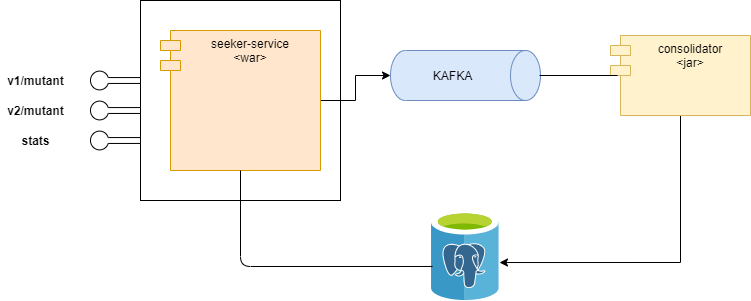

# Mutant-seeker

> Mutant-seeker is the project to detect if a human is mutant based on the dna sequence


## Architecture


> The architecture is conform by:

> 1. **seeker-service**: It is a component that contains the services to expose the solution to the problem of detect if a human is mutant (**v1/mutant**, **v2/mutan**). In this case was exposed two services cause was made two algorithm how solution. In each algorithm once is determined if a human is mutant, it is put  a messages in a broker kafka to avoid have to deal with the persistence and consolidation of data. The other is the **stats** service that get the information statistical of de dna processed. This information is taken from a table databases with the data already consolidated 
> 2. **kafka**: It's use a kafka broker to allow asynchronous on process of persistence and consolidation of data without affect the performance in main service mutant
> 3. **consolidator**: It´s a component that Listen and consume message from kafka broker (Topic) to process those messages and save information in a table databases where is persisted dna information and the result of seeker mutant.    
> 4. **databases**: It´s a postgres databases call **dna**. this has two tables (dna and consolidated) the first table has all dna processed and the result if is mutant or not. the other table contains the consolidate information about the amount of mutants and humans found. The information in this table is provided via a trigger in the dna table.      

## Getting Started

## Installation

this project can be executed completely even the infrastructure through of docker swarm for this reason the executions instructions are oriented to this way

### Prerequisites
The things you need to run the component are:
1. [Java]
2. [Maven]
3. [Tomcat]
4. [Docker] (the latest versions of docker who include docker swarm)


### Download project

via https: https://github.com/deiru87/mutant-seeker

via ssh: git@github.com:deiru87/mutant-seeker.git

Branch: master


### Build images docker

The images for project was push in the docker hub registry. so you can decide use the images push in my own docker or build the images and push the same in the registry that you prefer. Remember if you decide use the images already pushed skip this part. 

#### Build

then type on console:
  ```sh
        cd /mutant-seeker
   ```

please type on console:
  ```sh
        mvn -P local clean package install docker:build
   ```   
This last command; compile, run unit test and build the docker images

#### Tag and Push Images in docker hub

you should login in your docker registry with your own credentials:something like that  (docker login -u pepito)
  
please type on console:    ```
                      docker images
                 ```     and save the id images for the images consolidator:1.0.0 and seeker-service:1.0.0

then use those ids for tag the images docker with your corresponding images. for instance:

  ```sh
        docker tag 78f82f44bbf5 deiru87/consolidator:1.0.0
        docker tag a087fe143bce deiru87/seeker-service:1.0.0
   ```   
deiru87 correspond with a user in docker hub. by last push the images

  ```sh
        docker push deiru87/consolidator:1.0.0
        docker push deiru87/seeker-service:1.0.0
   ```  

### Prepare docker swarm, infrastructure and deploy

you should prepare all for deploy the Api. So you should configure a swarm cluster (Yeah I know that swarm is made for production environment. But is my approach ;) ). Remember is necessary have docker installed and configured in your machine.  

#### Create network

type on console:
```sh
        docker network create -d overlay --attachable deimer-network
```

#### initialize docker swarm  - convert current node in manager

type:
```sh
        docker swarm init
```

#### Create Stack infra

type on console:
```sh
        docker stack deploy --with-registry-auth -c infra/infra.yml infra
```
you should make sure that docker swarm created a stack and the services are running. for this type:

```sh
        docker stack services infra
```

#### create stack mutant

type on console:
```sh
        docker stack deploy --with-registry-auth -c infra/mutant.yml mutant
```
you should make sure that docker swarm created a stack and the services are running. for this type:

```sh
        docker stack services mutant
```

#### Create schema Database Postgres

this project use the plugin flyway of maven to version Database Scripts that include DDL and DML.

type on console:
```sh
        mvn clean flyway:migrate 
```

Note: The scripts is in mutant-seeker/seeker-service/database/migration.


That was the last part. we should have the complete Api-Rest Mutant Running.


## Automatic tests

For this project was elaborated a project to execute automatic test, please go to the link
https://github.com/deiru87/mutant-automation-test.git.
that project was made with java and cucumber and correspond with a little sample of automatic test for our rest API mutant.


## Services Documentation
#### Health Check
Request:
```sh
URL: http://[IP]:[PORT]/actuator/health
Method: GET
```
Response with 200 OK:
```json
{"status":"UP"}
```

#### Mutan Version 1 Service
This service validate if a human is a mutant. Searching in a dna sequences if there is 4 letters consecutive equals in the
way horizontal, vertical or diagonal in a matrix NxX describe for array of string.

***Method: POST***

```sh
URL: http://localhost:8087/v1/mutant
Method: POST
Header: Content-type:application/json

curl --request POST \
  --url http://localhost:8087/v1/mutant \
  --header 'content-type: application/json' \
  --data '{
	"dna" :  
	["ATGCGA","CAGTGC","TTATGG","AGAAGG","CCCCAA","TCACTG"]
}'
```

Request Body:
```json
        {
            "dna" :  ["ATGCGA","CAGTGC","TTATGG","AGAAGG","CCCCAA","TCACTG"]
        }
```

Body Parameters:
* **dna**: represent sequence of dna  **[REQUIRED]**


Output:

Response when was found a mutant:

        ```
            HTTP 200 OK
        ```

Response when was not found a mutant:

        ```
            HTTP 403 Forbidden
        ```
        
        
#### Mutan Version 2 Service
This service validate if a human is a mutant. Searching in a dna sequences if there is 4 letters consecutive equals in the
way horizontal, vertical or diagonal in a matrix NxX describe for array of string.

***Method: Post***

```sh
URL: http://localhost:8087/v1/mutant
Method: POST
Header: Content-type:application/json

curl --request POST \
  --url http://localhost:8087/v2/mutant \
  --header 'content-type: application/json' \
  --data '{
	"dna" :  
	["ATGCGA","CAGTGC","TTATGG","AGAAGG","CCCCAA","TCACTG"]
}'
```

Request Body:
```json
        {
            "dna" :  ["ATGCGA","CAGTGC","TTATGG","AGAAGG","CCCCAA","TCACTG"]
        }
```

Body Parameters:
* **dna**: represent sequence of dna  **[REQUIRED]**


Output:

Response when was found a mutant:

        ```
            HTTP 200 OK
        ```

Response when was not found a mutant:

        ```
            HTTP 403 Forbidden
        ```
        

#### Stats Service

This service get information statistic of the dna processed.
        

***Method: GET***

```sh
URL: http://localhost:8087/stats
Method: GET

curl --request GET \
  --url http://localhost:8087/stats  
```

Output:

Response when was found information:

        ```json
            {
              "count_mutant_dna": 1,
              "count_human_dna": 2,
              "ratio": 0.5
            }
        ```

Response when was not found a mutant: response without json

        ```
            HTTP 200 OK 
        ```


